# Interrupt_STM32


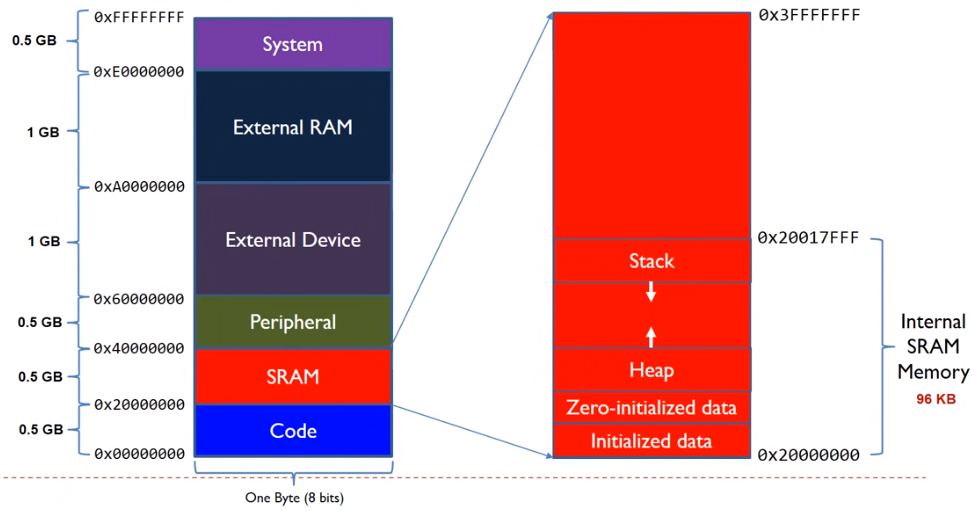


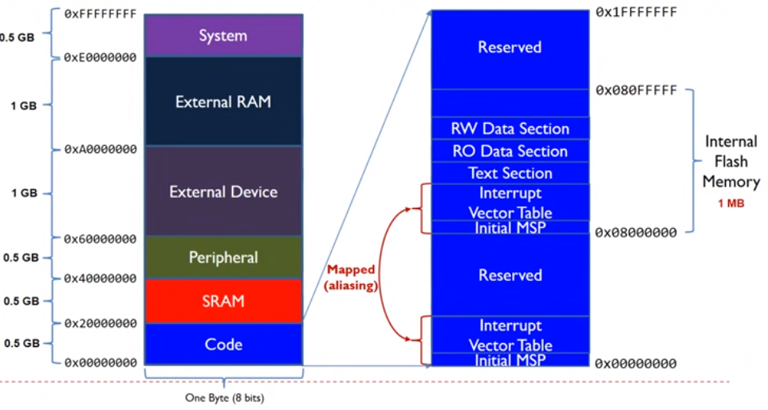

Таблица прерываний она нужна МК , чтобы понимать что в случае если придет внешнее событие , которое прервет исполнение основного кода на какой адрес нужно перейти , чтобы исполнить соответсвующий обработчик


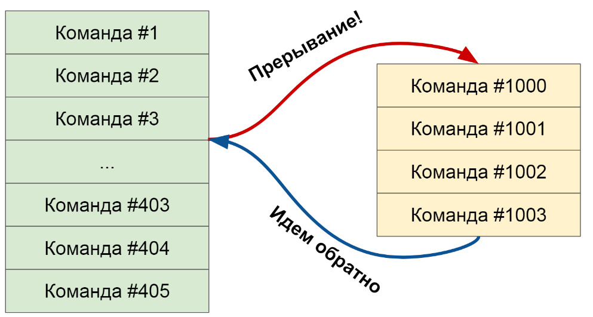


<p align="center">
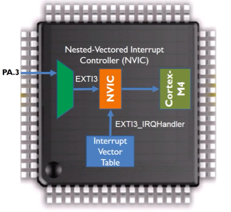
</<p align="center">


Два блока NVIC и SCB (все до SysTick к SCB , а периф. уже NVIC)

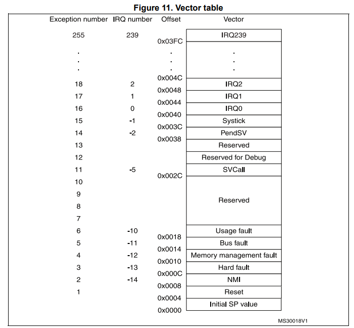

<p align="center">
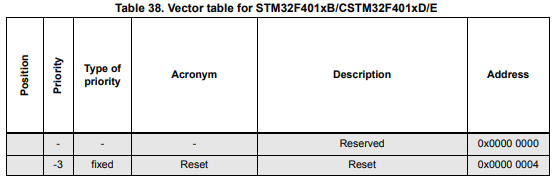
</<p align="center">
<p align="center">
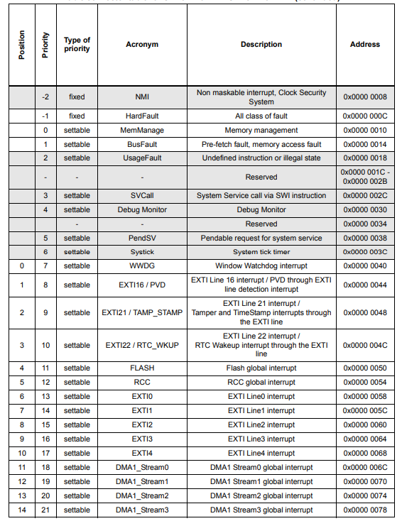
</<p align="center">
<p align="center">
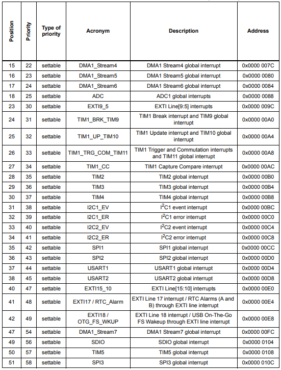
</<p align="center">


Если это таймер который каждую через каждую секунду генерирует внешнее событие необх чтобы Мк прервался свое исполнение перешел в вектор прерываний для конкретного таймер анашел соответсвуюющий адрес в таблице векторов прер перешел по этому адрес в другой участок кода и обработал а потом вернулся обратно.


stm32f401xe.h

```C
/******  Cortex-M4 Processor Exceptions Numbers ****************************************************************/
  NonMaskableInt_IRQn         = -14,    /*!< 2 Non Maskable Interrupt                                          */
  MemoryManagement_IRQn       = -12,    /*!< 4 Cortex-M4 Memory Management Interrupt                           */
  BusFault_IRQn               = -11,    /*!< 5 Cortex-M4 Bus Fault Interrupt                                   */
  UsageFault_IRQn             = -10,    /*!< 6 Cortex-M4 Usage Fault Interrupt                                 */
  SVCall_IRQn                 = -5,     /*!< 11 Cortex-M4 SV Call Interrupt                                    */
  DebugMonitor_IRQn           = -4,     /*!< 12 Cortex-M4 Debug Monitor Interrupt                              */
  PendSV_IRQn                 = -2,     /*!< 14 Cortex-M4 Pend SV Interrupt                                    */
  SysTick_IRQn                = -1,     /*!< 15 Cortex-M4 System Tick Interrupt                                */
/******  STM32 specific Interrupt Numbers **********************************************************************/
  WWDG_IRQn                   = 0,      /*!< Window WatchDog Interrupt                                         */
  PVD_IRQn                    = 1,      /*!< PVD through EXTI Line detection Interrupt                         */
  TAMP_STAMP_IRQn             = 2,      /*!< Tamper and TimeStamp interrupts through the EXTI line             */
  RTC_WKUP_IRQn               = 3,      /*!< RTC Wakeup interrupt through the EXTI line                        */
  FLASH_IRQn                  = 4,      /*!< FLASH global Interrupt                                            */
  RCC_IRQn                    = 5,      /*!< RCC global Interrupt                                              */
  EXTI1_IRQn                  = 7,      /*!< EXTI Line1 Interrupt                                              */
  EXTI2_IRQn                  = 8,      /*!< EXTI Line2 Interrupt                                              */
  EXTI3_IRQn                  = 9,      /*!< EXTI Line3 Interrupt                                              */
  EXTI4_IRQn                  = 10,     /*!< EXTI Line4 Interrupt                                              */
  DMA1_Stream0_IRQn           = 11,     /*!< DMA1 Stream 0 global Interrupt                                    */
  DMA1_Stream1_IRQn           = 12,     /*!< DMA1 Stream 1 global Interrupt                                    */
  DMA1_Stream2_IRQn           = 13,     /*!< DMA1 Stream 2 global Interrupt                                    */
  DMA1_Stream3_IRQn           = 14,     /*!< DMA1 Stream 3 global Interrupt                                    */
  DMA1_Stream4_IRQn           = 15,     /*!< DMA1 Stream 4 global Interrupt                                    */
  DMA1_Stream5_IRQn           = 16,     /*!< DMA1 Stream 5 global Interrupt                                    */
  DMA1_Stream6_IRQn           = 17,     /*!< DMA1 Stream 6 global Interrupt                                    */
  ADC_IRQn                    = 18,     /*!< ADC1, ADC2 and ADC3 global Interrupts                             */
  EXTI9_5_IRQn                = 23,     /*!< External Line[9:5] Interrupts                                     */
  TIM1_BRK_TIM9_IRQn          = 24,     /*!< TIM1 Break interrupt and TIM9 global interrupt                    */
  TIM1_UP_TIM10_IRQn          = 25,     /*!< TIM1 Update Interrupt and TIM10 global interrupt                  */
  TIM1_TRG_COM_TIM11_IRQn     = 26,     /*!< TIM1 Trigger and Commutation Interrupt and TIM11 global interrupt */
  TIM1_CC_IRQn                = 27,     /*!< TIM1 Capture Compare Interrupt                                    */
  TIM2_IRQn                   = 28,     /*!< TIM2 global Interrupt                                             */
  TIM3_IRQn                   = 29,     /*!< TIM3 global Interrupt                                             */
  TIM4_IRQn                   = 30,     /*!< TIM4 global Interrupt                                             */
  I2C1_EV_IRQn                = 31,     /*!< I2C1 Event Interrupt                                              */
  I2C1_ER_IRQn                = 32,     /*!< I2C1 Error Interrupt                                              */
  I2C2_EV_IRQn                = 33,     /*!< I2C2 Event Interrupt                                              */
  I2C2_ER_IRQn                = 34,     /*!< I2C2 Error Interrupt                                              */
  SPI1_IRQn                   = 35,     /*!< SPI1 global Interrupt                                             */
  SPI2_IRQn                   = 36,     /*!< SPI2 global Interrupt                                             */
  USART1_IRQn                 = 37,     /*!< USART1 global Interrupt                                           */
  USART2_IRQn                 = 38,     /*!< USART2 global Interrupt                                           */
  EXTI15_10_IRQn              = 40,     /*!< External Line[15:10] Interrupts                                   */
  RTC_Alarm_IRQn              = 41,     /*!< RTC Alarm (A and B) through EXTI Line Interrupt                   */
  OTG_FS_WKUP_IRQn            = 42,     /*!< USB OTG FS Wakeup through EXTI line interrupt                     */
  DMA1_Stream7_IRQn           = 47,     /*!< DMA1 Stream7 Interrupt                                            */
  SDIO_IRQn                   = 49,     /*!< SDIO global Interrupt                                             */
  TIM5_IRQn                   = 50,     /*!< TIM5 global Interrupt                                             */
  SPI3_IRQn                   = 51,     /*!< SPI3 global Interrupt                                             */
  DMA2_Stream0_IRQn           = 56,     /*!< DMA2 Stream 0 global Interrupt                                    */
  DMA2_Stream1_IRQn           = 57,     /*!< DMA2 Stream 1 global Interrupt                                    */
  DMA2_Stream2_IRQn           = 58,     /*!< DMA2 Stream 2 global Interrupt                                    */
  DMA2_Stream3_IRQn           = 59,     /*!< DMA2 Stream 3 global Interrupt                                    */
  DMA2_Stream4_IRQn           = 60,     /*!< DMA2 Stream 4 global Interrupt                                    */
  OTG_FS_IRQn                 = 67,     /*!< USB OTG FS global Interrupt                                       */
  DMA2_Stream5_IRQn           = 68,     /*!< DMA2 Stream 5 global interrupt                                    */
  DMA2_Stream6_IRQn           = 69,     /*!< DMA2 Stream 6 global interrupt                                    */
  DMA2_Stream7_IRQn           = 70,     /*!< DMA2 Stream 7 global interrupt                                    */
  USART6_IRQn                 = 71,     /*!< USART6 global interrupt                                           */
  I2C3_EV_IRQn                = 72,     /*!< I2C3 event interrupt                                              */
  I2C3_ER_IRQn                = 73,     /*!< I2C3 error interrupt                                              */
  FPU_IRQn                    = 81,     /*!< FPU global interrupt                                              */
  SPI4_IRQn                   = 84      /*!< SPI4 global Interrupt                                              */
```
startup
```C
g_pfnVectors:
  .word _estack
  .word Reset_Handler
  .word NMI_Handler
  .word HardFault_Handler
  .word	MemManage_Handler
  .word	BusFault_Handler
  .word	UsageFault_Handler
  .word	0
  .word	0
  .word	0
  .word	0
  .word	SVC_Handler
  .word	DebugMon_Handler
  .word	0
  .word	PendSV_Handler
  .word	SysTick_Handler
  .word	0                            			/* Reserved                                                                        */
  .word	EXTI16_PVD_IRQHandler        			/* EXTI Line 16 interrupt /PVD through EXTI line detection interrupt               */
  .word	TAMP_STAMP_IRQHandler        			/* Tamper and TimeStamp interrupts through the EXTI line                           */
  .word	EXTI22_RTC_WKUP_IRQHandler   			/* EXTI Line 22 interrupt /RTC Wakeup interrupt through the EXTI line              */
  .word	FLASH_IRQHandler             			/* FLASH global interrupt                                                          */
  .word	RCC_IRQHandler               			/* RCC global interrupt                                                            */
  .word	EXTI0_IRQHandler             			/* EXTI Line0 interrupt                                                            */
  .word	EXTI1_IRQHandler             			/* EXTI Line1 interrupt                                                            */
  .word	EXTI2_IRQHandler             			/* EXTI Line2 interrupt                                                            */
  .word	EXTI3_IRQHandler             			/* EXTI Line3 interrupt                                                            */
  .word	EXTI4_IRQHandler             			/* EXTI Line4 interrupt                                                            */
  .word	DMA1_Stream0_IRQHandler      			/* DMA1 Stream0 global interrupt                                                   */
  .word	DMA1_Stream1_IRQHandler      			/* DMA1 Stream1 global interrupt                                                   */
  .word	DMA1_Stream2_IRQHandler      			/* DMA1 Stream2 global interrupt                                                   */
  .word	DMA1_Stream3_IRQHandler      			/* DMA1 Stream3 global interrupt                                                   */
  .word	DMA1_Stream4_IRQHandler      			/* DMA1 Stream4 global interrupt                                                   */
  .word	DMA1_Stream5_IRQHandler      			/* DMA1 Stream5 global interrupt                                                   */
  .word	DMA1_Stream6_IRQHandler      			/* DMA1 Stream6 global interrupt                                                   */
  .word	ADC_IRQHandler               			/* ADC1 global interrupt                                                           */
  .word	0                            			/* Reserved                                                                        */
  .word	0                            			/* Reserved                                                                        */
  .word	0                            			/* Reserved                                                                        */
  .word	0                            			/* Reserved                                                                        */
  .word	EXTI9_5_IRQHandler           			/* EXTI Line[9:5] interrupts                                                       */
  .word	TIM1_BRK_TIM9_IRQHandler     			/* TIM1 Break interrupt and TIM9 global interrupt                                  */
  .word	TIM1_UP_TIM10_IRQHandler     			/* TIM1 Update interrupt and TIM10 global interrupt                                */
  .word	TIM1_TRG_COM_TIM11_IRQHandler			/* TIM1 Trigger and Commutation interrupts and TIM11 global interrupt              */
  .word	TIM1_CC_IRQHandler           			/* TIM1 Capture Compare interrupt                                                  */
  .word	TIM2_IRQHandler              			/* TIM2 global interrupt                                                           */
  .word	TIM3_IRQHandler              			/* TIM3 global interrupt                                                           */
  .word	TIM4_IRQHandler              			/* TIM4 global interrupt                                                           */
  .word	I2C1_EV_IRQHandler           			/* I2C1 event interrupt                                                            */
  .word	I2C1_ER_IRQHandler           			/* I2C1 error interrupt                                                            */
  .word	I2C2_EV_IRQHandler           			/* I2C2 event interrupt                                                            */
  .word	I2C2_ER_IRQHandler           			/* I2C2 error interrupt                                                            */
  .word	SPI1_IRQHandler              			/* SPI1 global interrupt                                                           */
  .word	SPI2_IRQHandler              			/* SPI2 global interrupt                                                           */
  .word	USART1_IRQHandler            			/* USART1 global interrupt                                                         */
  .word	USART2_IRQHandler            			/* USART2 global interrupt                                                         */
  .word	0                            			/* Reserved                                                                        */
  .word	EXTI15_10_IRQHandler         			/* EXTI Line[15:10] interrupts                                                     */
  .word	EXTI17_RTC_Alarm_IRQHandler  			/* EXTI Line 17 interrupt / RTC Alarms (A and B) through EXTI line interrupt       */
  .word	EXTI18_OTG_FS_WKUP_IRQHandler			/* EXTI Line 18 interrupt / USBUSB On-The-Go FS Wakeup through EXTI line interrupt */
  .word	0                            			/* Reserved                                                                        */
  .word	0                            			/* Reserved                                                                        */
  .word	0                            			/* Reserved                                                                        */
  .word	0                            			/* Reserved                                                                        */
  .word	DMA1_Stream7_IRQHandler      			/* DMA1 Stream7 global interrupt                                                   */
  .word	0                            			/* Reserved                                                                        */
  .word	SDIO_IRQHandler              			/* SDIO global interrupt                                                           */
  .word	TIM5_IRQHandler              			/* TIM5 global interrupt                                                           */
  .word	SPI3_IRQHandler              			/* SPI3 global interrupt                                                           */
  .word	0                            			/* Reserved                                                                        */
  .word	0                            			/* Reserved                                                                        */
  .word	0                            			/* Reserved                                                                        */
  .word	0                            			/* Reserved                                                                        */
  .word	DMA2_Stream0_IRQHandler      			/* DMA2 Stream0 global interrupt                                                   */
  .word	DMA2_Stream1_IRQHandler      			/* DMA2 Stream1 global interrupt                                                   */
  .word	DMA2_Stream2_IRQHandler      			/* DMA2 Stream2 global interrupt                                                   */
  .word	DMA2_Stream3_IRQHandler      			/* DMA2 Stream3 global interrupt                                                   */
  .word	DMA2_Stream4_IRQHandler      			/* DMA2 Stream4 global interrupt                                                   */
  .word	0                            			/* Reserved                                                                        */
  .word	0                            			/* Reserved                                                                        */
  .word	0                            			/* Reserved                                                                        */
  .word	0                            			/* Reserved                                                                        */
  .word	0                            			/* Reserved                                                                        */
  .word	0                            			/* Reserved                                                                        */
  .word	OTG_FS_IRQHandler            			/* USB On The Go FS global interrupt                                               */
  .word	DMA2_Stream5_IRQHandler      			/* DMA2 Stream5 global interrupt                                                   */
  .word	DMA2_Stream6_IRQHandler      			/* DMA2 Stream6 global interrupt                                                   */
  .word	DMA2_Stream7_IRQHandler      			/* DMA2 Stream7 global interrupt                                                   */
  .word	USART6_IRQHandler            			/* USART6 global interrupt                                                         */
  .word	I2C3_EV_IRQHandler           			/* I2C3 event interrupt                                                            */
  .word	I2C3_ER_IRQHandler           			/* I2C3 error interrupt                                                            */
  .word	0                            			/* Reserved                                                                        */
  .word	0                            			/* Reserved                                                                        */
  .word	0                            			/* Reserved                                                                        */
  .word	0                            			/* Reserved                                                                        */
  .word	0                            			/* Reserved                                                                        */
  .word	0                            			/* Reserved                                                                        */
  .word	0                            			/* Reserved                                                                        */
  .word	0                            			/* Reserved                                                                        */
  .word	0                            			/* Reserved                                                                        */
  .word	0                            			/* Reserved                                                                        */
  .word	SPI4_IRQHandler              			/* SPI4 global interrupt                                                           */
```
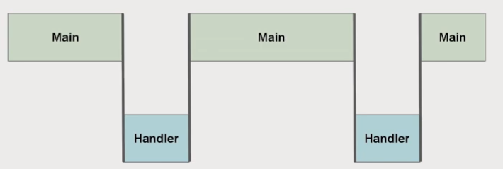
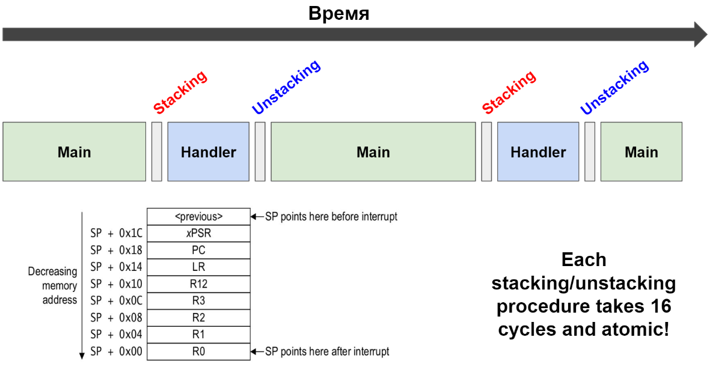

Вложенные прерывания. Вытеснение 

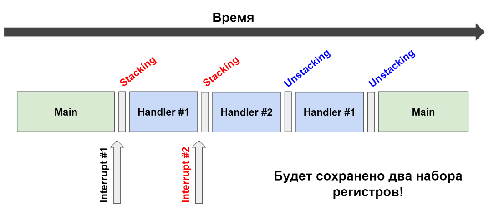

Ожидание

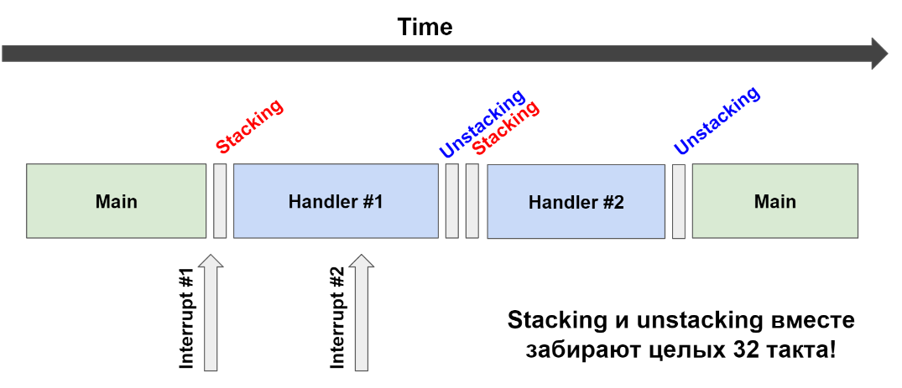

Tail-Chaining

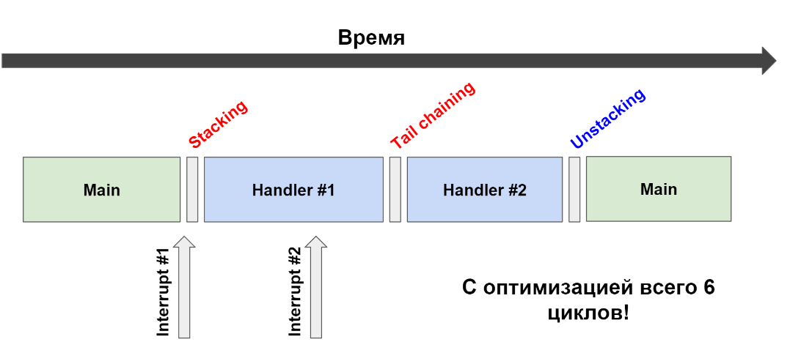

Late-arriving
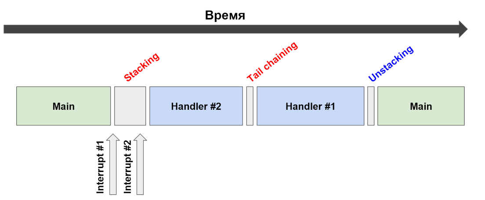

Контроллер внешних событий 
23 канала - 16 могут быть подключены к одному из GPIO 


<p align="center">
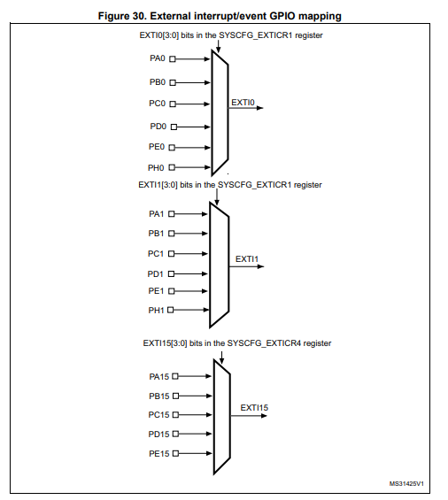
</<p align="center">


