# Таймер STM32 в режиме частотомера
 * NUCLEO-F401RE
 * STM32F401RET6U
 * ARM Cortex M4
 * HAL
 * STM32 CubeIDE v1.13.2

>Программа реализует подсчет внешней частоты с помощью таймера TIM2. Таймер тактируется от измеряемой частоты, в нашем случае с MCO1  через ETR-пин.

Таймер TIM1 будет отмерять интервал времени равный одной секунде. Таймер TIM2 будет тактироваться от измеряемой частоты через ETR-пин, и тем самым его счётчик будет выступать в роли счётчика импульсов. TIM2 32-х битный, следовательно TIM2 сможет насчитать 4294967295 импульсов, что убирает барьер каскадного подключения таймеров при использовании 16-ти битных таймеров.

1. Настраиваем систему тактирования на максимум -> 84MHz
   
---
<details>
  <summary>Особенность шины APB1</summary>
  Если для тактирования шины APB1 используется делитель больше 1, то тактирование таймеров происходит с частотой в 2 раза больше частоты тактового сигнала в шине. То есть, если для шины установить делитель /2, то у таймера появится множитель X2

  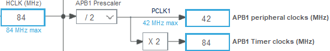
</details>   

---

2. Источник тактирование для TIM2
   
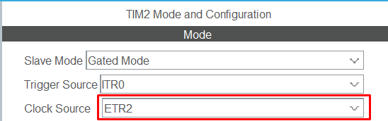

3. Активируем пин RCC_MCO1 (Master Clock Output 1), он будет выдавать частоту для проверки нашего частотомера

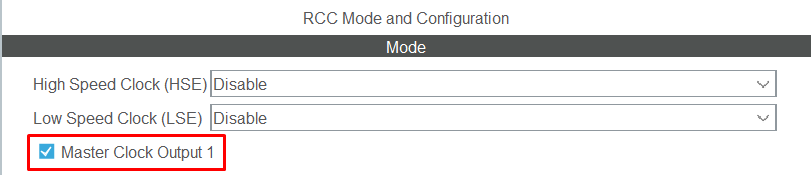

4. Указываем максимальную скорость (Maximum output speed) для пина PA8

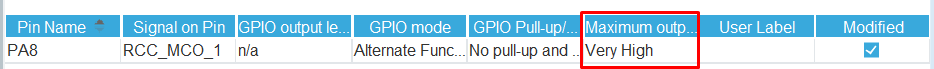
---
<details>
  <summary>Скоростные характеристики портов</summary>

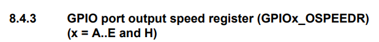
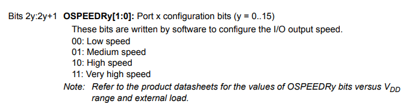
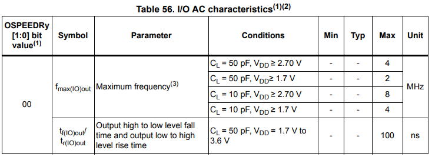
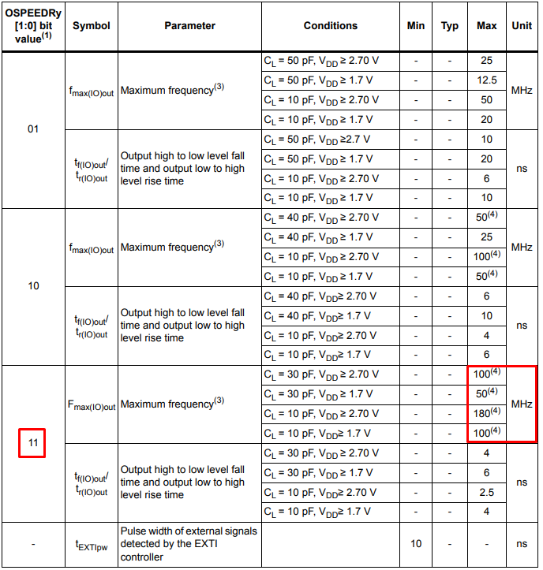

</details>   

---
 5. Источником для выхода MCO указываем PLL
   
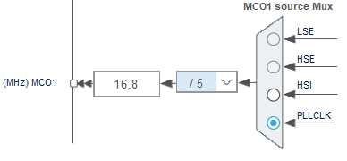

Перед бесконечным циклом запускаем TIM1 в режиме прерывания, и активируем TIM2

```C
//...
HAL_TIM_Base_Start_IT(&htim1);
HAL_TIM_Base_Start(&htim2);
//...
```
Добавляем функцию Callback
```C
//...
 void HAL_TIM_PeriodElapsedCallback(TIM_HandleTypeDef *htim){

	if (htim == &htim1){

			  count_main = __HAL_TIM_GET_COUNTER(&htim2);
			  HAL_TIM_Base_Stop_IT(&htim1);
			  __HAL_TIM_SET_COUNTER(&htim2, 0x0000);
			  HAL_TIM_Base_Start_IT(&htim1);
	}
}
//...
```
Результат точный

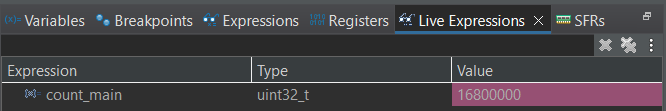

Для 42MHz

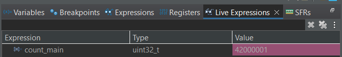

Cейчас микроконтроллер измеряет частоту, которую он сам и выдаёт, то есть таймеры занимающиеся подсчётом, синхронизированы с этой частотой 
> Когда и ядро, и таймеры, и другая периферия тактируется от одного источника, то в микроконтроллере всё работает синхронно. В нашем случае микроконтроллер тактируется от HSI

Но если подать сигнал с другого источника тактирования, то значение будет искажаться. И с увеличением частоты погрешность будет увеличиваться 

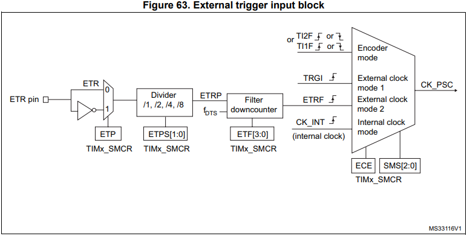

Входящая частота приходит на ETR-пин, попадает в асинхронный предделитель, делится там, попадает в фильтр, где выполняется сэмплирование этого сигнала с помощью системной частоты — fDTS.

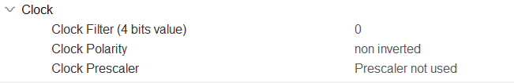

Входящий сигнал сэмплируется системной частотой таймера (выборки). Если в течении заданного количества выборок сигнал был стабилен, то всё окей, если же он переключился раньше чем закончились выборки, то это расценивается как дребезг и отвергается.

Частота и количество сэмплов (выборок) задаётся цифрами от 0 до 15, которые соответствуют следующим фильтрам:
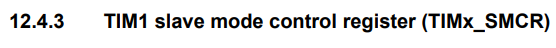
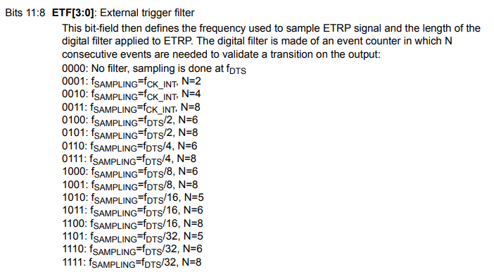
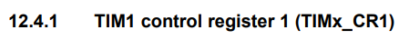
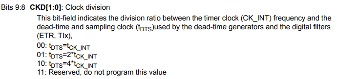


Ниже представлен пример

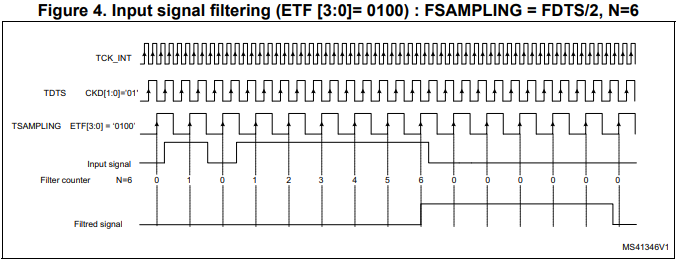
TCK_INT
Опорной частотой для сэмплирования служит системная частота таймера.

**TDTS** -
Вспомогательный тактовый сигнал. Частота TDTS получается после того, как частота TCK_INT делится делителем Internal Clock Division (CKD) на два. Если CKD не используется, то TDTS будет равна TCK_INT.

>CKD применяется в том случае, если нужно увеличить время исследования сигнала — частота сэмплов уменьшится, следовательно проверка будет происходить дольше.

**TSAMPLING** -
Применяя фильтр fSAMPLING=fDTS/2, N=6 к частоте TDTS мы делим её на два, и получаем частоту сэмплирования — TSAMPLING в четыре раза меньше системной частоты таймера. Количество сэмплов будет 6.

В итоге к входящему сигналу будет применено шесть выборок. Если на протяжении этого времени сигнал не менял полярность, то всё окей. Любой сигнал с меньшей длительностью будет отклонён.

Так как все шесть выборок были успешные, отфильтрованный сигнал (Filtred signal) переключился в HIGH. Как видно, переключение отфильтрованных сигналов будет происходить с небольшим сдвигом во времени, равным времени выборок.

Если планируется использовать фильтр, то его нужно подбирать так, чтоб он был меньше длины импульса входящего сигнала.

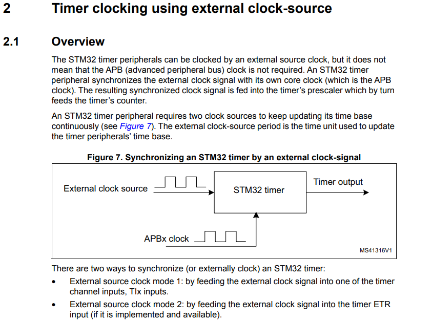
> Таймер STM32 синхронизирует внешний тактовый сигнал со своим собственным(тактовый сигнал шины APB). Синхронизированный тактовый сигнал подается на предделитель таймера, который, в свою очередь, подает сигнал на счетчик таймера.

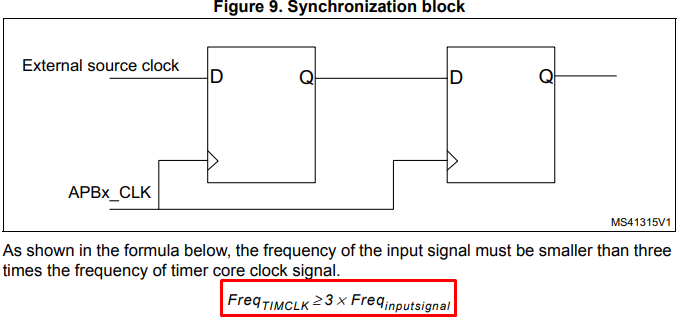
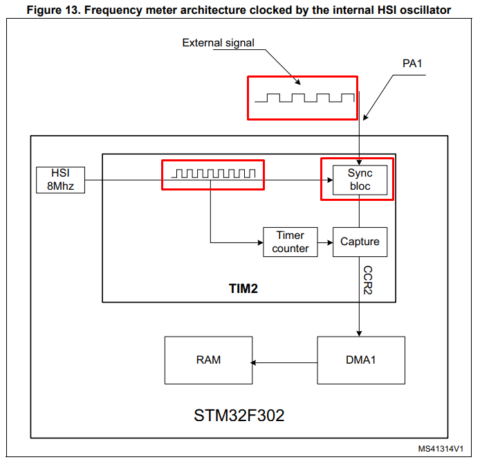
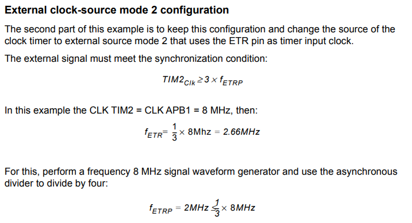

Из теоремы Котельникова следует что для успешной дискретизации сигнала, системная частота должна более чем в два раза превышать измеряемую, а в мануале на микроконтроллер говориться что системная частота должна быть выше в три раза.
Максимальная измеряемая частота зависит от того, на какой частоте работает сам микроконтроллер, если на 84МГц, то можно измерить частоту около 224 МГц.


При старте, таймер TIM1 будет аппаратно подавать этот сигнал на TIM2 и тем самым запускать его.


